# Machine Learning

说明：本文档基于Machine Learning in Action编写而成，其中整理了一些网上的资源和西瓜书的内容，但编写时没有悉数记录来源，在此致歉！

[TOC]

<div style="page-break-after: always;"></div>

## 一、基本概念

机器学习就是要学一个【函数】。例如：

- 普通编程：给定一个add函数，输入2和2，得到4；
- 机器学习：给出一些例子：2+2=4，3+3=6，……，电脑学出来add函数。

定义：Machine learning involves computers discovering how they can perform tasks **without being explicitly programmed to do so**. It involves computers learning from **data provided** so that they carry out **certain tasks**. （来自wiki）

- 无需【显式】编程
- 从【数据】中进行学习
- 特定任务

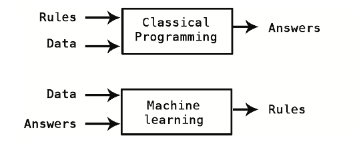

### 1.1 例子

西瓜分类例子：把西瓜分为好瓜和坏瓜两类。

- 分类依据：色泽、根蒂、敲声
- 分类结果：好瓜与否


一些相关概念：

- model（模型）：模型是在指定的假设空间中，确定学习策略，通过优化算法去学习到的**由输入到输出的映射**。
- feature（特征）：属性值，也就是**输入**，如上述的色泽、根蒂、敲声，每一列都是一个feature。
- target variable（目标变量）：模型的**输出**，上述数据集的最后一列（好瓜这一列）。
- label（标签）：预测的结论，比如第一个瓜的label是【是好瓜】。
- instance（样本）：上述每一行（每一个瓜）。
- class（类别）：分类问题的目标变量（好瓜这一列的【是】和【否】分别是两个class）。
- ground truth：参考标准，也就是正确的标签，用于判断模型表现是好还是坏。

<div style="page-break-after: always;"></div>

### 1.2 机器学习任务分类（部分）

- 监督学习（每个训练数据都有标签）
  
  - 根据已有的数据集，知道输入和输出结果之间的关系。根据这种已知的关系，训练得到一个最优的模型。也就是说，在监督学习中训练数据既有特征(feature)又有标签(label)，通过训练，让机器可以自己找到特征和标签之间的联系，在面对只有特征没有标签的数据时，可以判断出标签。
  
  - 我们在监督（教）电脑做事
  
  - 两个重要的任务：分类（classification，结果是某个/某些类别）和 回归（regression，结果是某个/某些数）：预测股票涨跌 和 预测房屋价格
  
  - 例子（图中既有房屋面积这个feature，也有价格这个label）：
  
    
  
- 无监督学习（每个训练数据都没有标签）
  
  - 我们不知道数据集中数据、特征之间的关系，而是要根据聚类或一定的模型得到数据之间的关系。
  - 比起监督学习，无监督学习更像是自学，让机器学会自己做事情，是没有标签（label）的。
  - 聚类（clustering，不知道每个数据应该是什么类别，根据数据本身来划分到不同类别中）
    - 
  - 嵌入（embedding，把一个东西变成一个向量）
    - 
  - 降维（dimensionality reduction，高维的变成低维，如把一张照片用一个长度为100的向量表示）

<div style="page-break-after: always;"></div>

- 强化学习（智能系统在与环境的连续交互中学习最佳行为策略）
  - 
- 半监督学习、主动学习……

### 1.3 和AI的关系

- 主流认为是AI包含ML
  - 
- 也有人认为ML只有“智能”的部分包括在AI中

Artificial Intelligence

- A system's ability to **correctly interpret external data**, to **learn from such data**, and to use those learnings to **achieve specific goals and tasks** through **flexible adaptation**.
- 解读【外部数据】&【学习】
- 达到某些目标和任务
- flexible adaptation：灵活的适应

<div style="page-break-after: always;"></div>

### 1.4 数据集划分

三部分：

- 训练集（training set）：用于训练模型，比如获得较好的一组模型参数；
- 验证集（validation set）：用于评估模型的设置是否合适，比如神经网络是2层好还是3层好，这里的层数（是一个超参数(hyperparameter)，不能在训练过程中更新）就是要用验证集调出来的；
- 测试集（test set）：最终评估模型到底表现如何。

类比一下：

- 训练集（training set）：平时学生接触到的课堂学习的例题、作业题；
- 验证集（validation set）：平时的期中期末考试，帮助学生调整学习方法和状态；
- 测试集（test set）：最后的高考，评估学生到底是什么水平。

一个划分方法：k-fold cross validation（用于训练的数据划分成k份，每次取其中一次作为验证集，剩下的用于训练，评估结果取平均）


### 1.5 评价指标

详见【西瓜书2.3 性能度量】

#### 1.5.1 分类任务

混淆矩阵：

- 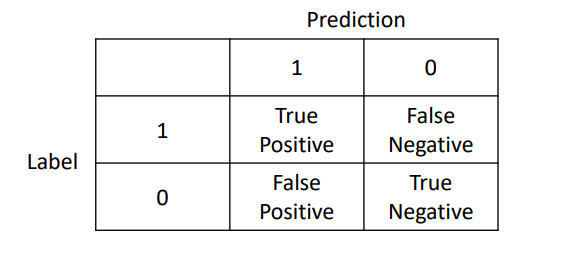
- 基于混淆矩阵得到的一些指标（常用的包括accuracy、precision、recall、F1)
- 

$$
\text{FPR}=1-\text{TNR}
$$
$$
\text{F1-score}=\frac{2 \text { Precision } * \text { Recall }}{\text { Precision }+\text { Recall }}
$$
- 对于其中一些指标的可视化图：
  - 

- 如果想要进行核酸检测，会比较关注recall（患病的人有多少能被检测出来）；如果想要选冬奥志愿者，会比较关注precision（选出的人有多少符合要求）

ROC和AUC：

- 一些情况下，会给每个数据打分，并且设置阈值判断结果是属于什么类别
- 但阈值不同，得到结果的指标不同。比如：所有数据打分范围是0-100，如果阈值设置比较小（所有大于阈值的都是positive），则混淆矩阵里第一列会比较大；但阈值设置比较小的时候，混淆矩阵里面第一列会比较小。所以使用每一行第一列和这行总体的比例（分别是TPR和FPR）画图即为ROC。
- 最好的情况是TPR为1，FPR为0（左上角的地方）；但阈值不同对应的值也不同，连起来可以得到一条曲线，随机的曲线对应的是$y=x$的直线。曲线下的面积（AUC）越大，说明模型越好。

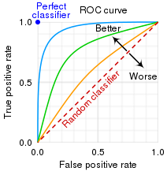

这里的指标比较多，可以看以下表格（来自维基百科）：

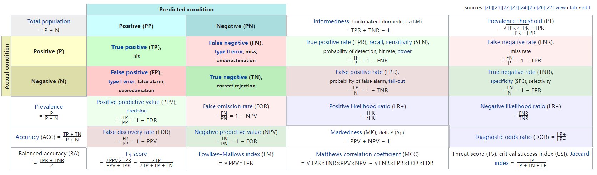

#### 1.5.2 回归任务

常用的指标包括MSE、MAE，就是衡量得到的结果（$\hat{y}$）和真实的结果（$y$）之间的差异：
$$
\begin{aligned}
&M A E=\frac{1}{N} \sum_{i=1}^{N}\left|y_{i}-\hat{y}\right| \\
&M S E=\frac{1}{N} \sum_{i=1}^{N}\left(y_{i}-\hat{y}\right)^{2} \\
&R M S E=\sqrt{M S E}=\sqrt{\frac{1}{N} \sum_{i=1}^{N}\left(y_{i}-\hat{y}\right)^{2}} \\
&R^{2}=1-\frac{\sum\left(y_{i}-\hat{y}\right)^{2}}{\sum\left(y_{i}-\bar{y}\right)^{2}}
\end{aligned}
$$
Where,
$$
\begin{aligned}
&\hat{y} \text { - predicted value of } y \\
&\bar{y} \text { - mean value of } y
\end{aligned}
$$

<div style="page-break-after: always;"></div>

### 1.6 泛化能力（generalization）

学习的目的是学到隐含在数据背后的规律，对具有同一规律的学习集以外的数据，经过训练的网络也能给出合适的输出，该**能力**称为**泛化能力**。

数据中可能有一些噪声（测量仪器的准确度、收集过程的错误、比较奇怪的数据……），收集到的数据不一定能反映所有的数据分布。

例如收集到的可能是：


真实数据可能是：


如果因为收集到的数据某个地方出现了一个黄色的数据点（比如中间位置），就把整个区域设置成黄色类别，会导致很多其他数据出现问题。

<div style="page-break-after: always;"></div>

### 1.7 过拟合 欠拟合

分类的例子：

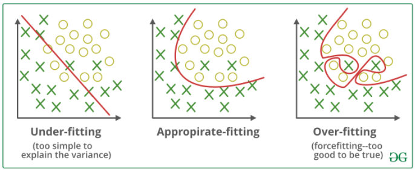

回归的例子：

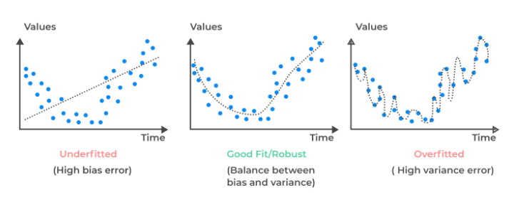

真实生活中的例子：


<div style="page-break-after: always;"></div>

## 二、数学基础

### 2.1 微积分

- 导数 和 梯度 的概念
  - 导数：$f^{\prime}\left(x_{0}\right)=\lim \limits_{\Delta x \rightarrow 0} \frac{\Delta y}{\Delta x}=\lim \limits_{\Delta x \rightarrow 0} \frac{f\left(x_{0}+\Delta x\right)-f\left(x_{0}\right)}{\Delta x}$
    - $f(x) \approx f\left(x_{0}\right)+f^{\prime}\left(x_{0}\right)\left(x-x_{0}\right)$
  - 梯度：$\nabla f=\left(\begin{array}{c}\frac{\partial f}{\partial x_{1}} \\ \frac{\partial f}{\partial x_{2}} \\ \vdots \\ \frac{\partial f}{\partial x_{n}}\end{array}\right)$
- 几何解释：
  - 导数：函数y=f(x)在x=x0处的导数f′(x0)，表示曲线y=f(x)在点P(x0,f(x0))处的切线的斜率k。描述了这个函数在这一点附近的变化率。
  - 梯度：梯度是一个向量(矢量)，表示某一函数在该点处的方向导数沿着该方向取得最大值，即函数在该点处沿着该方向(此梯度的方向)变化最快，变化率最大(为该梯度的模)。
  - 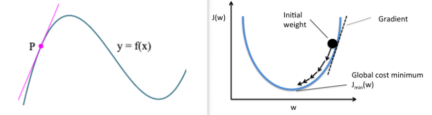
- 梯度下降：使得函数越来越小
  - 

<div style="page-break-after: always;"></div>

- 导数运算：
  
  - 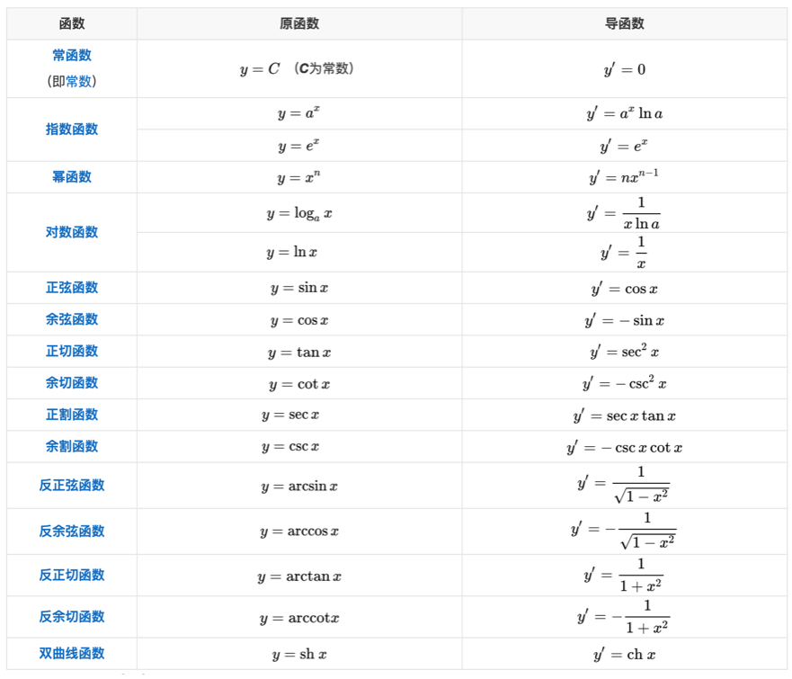

- 导数的四则运算：
  
  - $(u \pm v)^{\prime}=u^{\prime} \pm v^{\prime}$
  - $(u v)^{\prime}=u^{\prime} v+u v^{\prime}$
  - $\left(\frac{u}{v}\right)^{\prime}=\frac{u^{\prime} v-u v^{\prime}}{v^{2}}$

<div style="page-break-after: always;"></div>

### 2.2 线性代数

- 向量内积：
  - $a=\left[a_{1}, a_{2}, \ldots a_{n}\right], b=\left[b_{1}, b_{2}, \ldots b_{n}\right], a \cdot b=a_{1} b_{1}+a_{2} b_{2}+\ldots+a_{\mathrm{n}} b_{n}$
- 矩阵（Matrix）
  - 矩阵是一个按照长方阵列排列的复数或实数集合。
  - $B=\left(\begin{array}{ll}5 & 7 \\ 6 & 8\end{array}\right)$
- 矩阵加法：
  - $\left[\begin{array}{lll}1 & 4 & 2 \\ 2 & 0 & 0\end{array}\right]+\left[\begin{array}{lll}0 & 0 & 5 \\ 7 & 5 & 0\end{array}\right]=\left[\begin{array}{lll}1+0 & 4+0 & 2+5 \\ 2+7 & 0+5 & 0+0\end{array}\right]=\left[\begin{array}{lll}1 & 4 & 7 \\ 9 & 5 & 0\end{array}\right]$
- 矩阵转置：
  - $\left[\begin{array}{ccc}2 & 4 & 3 \\ 0 & -2 & 8\end{array}\right]^{T}=\left[\begin{array}{cc}2 & 0 \\ 4 & -2 \\ 3 & 8\end{array}\right]$
- 矩阵乘法：
  - $\left[\begin{array}{cll}1 & 0 & 2 \\ -1 & 3 & 1\end{array}\right] \times\left[\begin{array}{cc}3 & 1 \\ 2 & 1 \\ 1 & 0\end{array}\right]=\left[\begin{array}{cc}(1 \times 3+0 \times 2+2 \times 1) & (1 \times 1+0 \times 1+2 \times 0) \\ (-1 \times 3+3 \times 2+1 \times 1) & (-1 \times 1+3 \times 1+1 \times 0)\end{array}\right]=\left[\begin{array}{cc}5 & 1 \\ 4 & 2\end{array}\right]$
- 单位矩阵：
  - 方阵，从左上角到右下角的对角线（主对角线）上的元素均为1。除此以外全都为0。记作$I$
  - $\left(\begin{array}{lll}1 & 0 & 0 \\ 0 & 1 & 0 \\ 0 & 0 & 1\end{array}\right)$
- 矩阵的逆：
  - $AA^{-1}=I$

<div style="page-break-after: always;"></div>

### 2.3 概率

- 条件概率
  - 条件概率是指事件A在事件B发生的条件下发生的概率。条件概率表示为：$P(A|B)$，读作“A在B发生的条件下发生的概率”。
  - 例子：研究某疾病，设人群中有1%的人罹患此疾病，而检验的机器错误率是1%。
    - 问：小明检测出患病（positive）时，真的患病的概率？
    
    - 混淆矩阵：
    
    - |               | 检测阳性(positive) | 检测阴性(negative) |
      | ------------- | ------------------ | ------------------ |
      | 患病(disease) | 99                 | 1                  |
      | 不患病(well)  | 99                 | 9801               |
    
    - $P(disease) = 1\% = 0.01, P(well) = 99\% = 0.99$
    
    - 误诊：$P(positive|well)=P(negative|disease) = 1\%=0.01$
    
    - 得病+确诊：$P(positive|disease) = 99\%=0.99$
      - 是整群人中得病、且测定为阳性者的比率
      
    - $P(disease|positive) = 50\%=0.5$
      - 检测出患病的包括：
        - 误诊$P(positive\ \and\ well) = 1\%\times P(well)=1\%\times99\%$，
        - 确诊$P(positive\ \and\ disease) = 99\%\times P(disease)=99\%\times 1\%$

<div style="page-break-after: always;"></div>

## 三、示例代码

### 01.sklearn使用-分类和回归

Windows：打开控制台（按键盘上的win+R，调出运行框，输入`cmd`回车），接着输入`pip install sklearn`回车（如果网络不好，可以用 `pip install sklearn -i http://pypi.douban.com/simple/  --trusted-host pypi.douban.com` ）

macOS：打开terminal（按下command+空格，搜索框里面输入`terminal`回车），接着输入`pip3 install sklearn`回车（如果网络不好，可以用 `pip3 install sklearn -i http://pypi.douban.com/simple/  --trusted-host pypi.douban.com` ）

安装其他包同理，把`sklearn`换成对应包的名字（如`pandas`）

#### 分类例子

Iris的数据，这种花有四个属性，花瓣的长宽，茎的长宽，根据这些属性把花分为三类。

我们要用`分类器`去把这些花分开。

``` python
# 数据准备
from sklearn import datasets
from sklearn.model_selection import train_test_split
from sklearn.neighbors import KNeighborsClassifier

iris = datasets.load_iris()
iris_X = iris.data
iris_y = iris.target
print(iris.target_names)

print(iris_X)
print(iris_y)


# 数据集划分
X_train, X_test, y_train, y_test = train_test_split(
    iris_X, iris_y, test_size=0.3)  # 测试集占30%
print(y_train)


# 训练&预测
knn = KNeighborsClassifier()
knn.fit(X_train, y_train)
print(knn.predict(X_test))
print(y_test)


# 评估
from sklearn.metrics import accuracy_score

accuracy_score(y_test, knn.predict(X_test))
```

#### 回归例子

```python
# 数据加载与划分
from sklearn import datasets
loaded_data = datasets.load_boston()

data_X = loaded_data.data
data_y = loaded_data.target
print(data_X.shape)
print(data_X[:5])
print(data_y[:5])
X_train, X_test, y_train, y_test = train_test_split(data_X, data_y, test_size=0.2)


# 回归模型
from sklearn.linear_model import LinearRegression

lr = LinearRegression()
lr.fit(X_train, y_train)
lr.predict(X_test)
```

### 02.sklearn使用-自己数据

详见代码库

### 13.SVM

详见代码库

<div style="page-break-after: always;"></div>

## 四、分类模型

### 4.1 KNN


- 和新来的数据最接近的k个，找到它们对应的类别
  - 这些类别里面占比最多的
  - 

<div style="page-break-after: always;"></div>

- 距离计算：
  - 欧式距离&扩展：
    - 数字：平方求和开根号
    - 类别：相同=0，不同=1
    - 都有：分别对于每一个属性信息计算，平方求和开根号
  - Minkowski距离/$L^p$范数距离：
    - $D(X, Y)=\left(\sum_{i=1}^{n}\left|x_{i}-y_{i}\right|^{p}\right)^{\frac{1}{p}}$
  - 余弦相似性：
    - $\cos (\theta)=\frac{A \cdot B}{\|A\|\|B\|}=\frac{\sum_{i=1}^{n} A_{i} \times B_{i}}{\sqrt{\sum_{i=1}^{n}\left(A_{i}\right)^{2}} \times \sqrt{\sum_{i=1}^{n}\left(B_{i}\right)^{2}}}$
  - 标准化/归一化（normalization）：
    - 
    - 两种方式：
      - 均值为0，方差为1
      - 调整到0-1
- 不同k的取值：
  - 

5NN的边界：

- 

<div style="page-break-after: always;"></div>

### 4.2 决策树

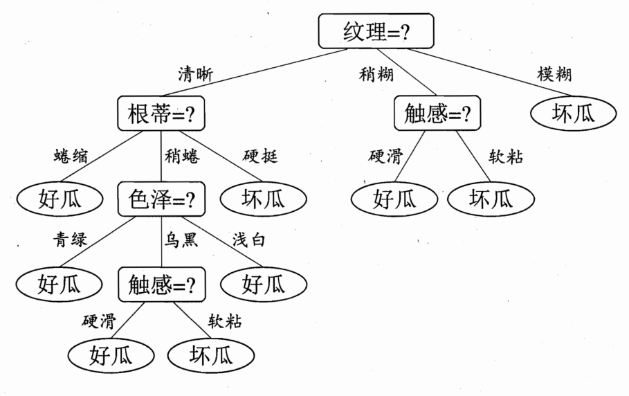

树结构：不断分叉，每个节点只有最多一个父节点。

#### 4.2.1 划分方式

- 怎样的数据才是分类好的？`50% A 50% B`还是`90%A 10%B`？
- 一个示例（选择【纹理】）：
  - 
  - 原来：【是】的比例：p1=8/17；【否】的比例：p2=9/17。
    - 如果不借助特征信息直接盲选，可以猜“否”，错误率8/17。
  - 如果按照且只按照【纹理】进行划分，每一部分分别得到一个判断结果：
    - 【模糊】和【稍糊】的猜“否”，【清晰】的猜“是”，错误率3/17
- 不断构建一些判断，一堆if-else的选择。判断过程中要使得数据更加有规律
  - 如：从`50% A 50% B`变为两部分，`[90%A 10%B] [90%B 10%A]`或者`[51%A 49%B] [51%B 49%A]`，前者更好。
- ID3算法：
  - 用熵(entropy)表示数据的“纯度”：$\operatorname{Ent}(D)=-\sum_{k=1}^{|\mathcal{Y}|} p_{k} \log _{2} p_{k}$ ，熵越低，纯度越高
  - 用熵的减少（信息增益$\operatorname{Gain}(D, a)=\operatorname{Ent}(D)-\sum_{v=1}^{V} \frac{\left|D^{v}\right|}{|D|} \operatorname{Ent}\left(D^{v}\right)$）衡量【用哪个feature判断效果最好】
  - 对于上面的例子：
    - $\operatorname{Ent}(D)=-\sum_{k=1}^{2} p_{k} \log _{2} p_{k}=-\left(\frac{8}{17} \log _{2} \frac{8}{17}+\frac{9}{17} \log _{2} \frac{9}{17}\right)=0.998$
    - 根据【纹理】划分后的信息熵：
      - $\operatorname{Ent}\left(D^{1}\right)=-\left(0 \log _{2} 0 + 1 \log _{2} 1\right)=0.000$
        $\operatorname{Ent}\left(D^{2}\right)=-\left(\frac{7}{9} \log _{2} \frac{7}{9}+\frac{2}{9} \log _{2} \frac{2}{9}\right)=0.7642$
        $\operatorname{Ent}\left(D^{3}\right)=-\left(\frac{1}{5} \log _{2} \frac{1}{5}+\frac{4}{5} \log _{2} \frac{4}{5}\right)=0.7220$
    - 信息增益：
      - $\begin{aligned} \operatorname{Gain}(D, \text { 纹理 }) &=\operatorname{Ent}(D)-\sum_{v=1}^{3} \frac{\left|D^{v}\right|}{|D|} \operatorname{Ent}\left(D^{v}\right) \\ &=0.998-\left(\frac{3}{17} \times 0.000+\frac{9}{17} \times 0.7642+\frac{5}{17} \times 0.7220\right) \\ &=0.381 \end{aligned}$
    - 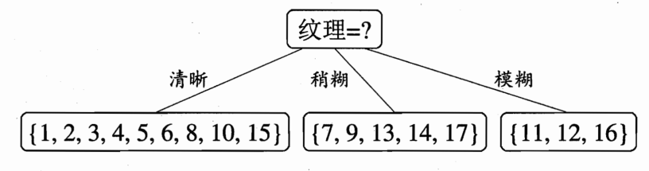

<div style="page-break-after: always;"></div>

### 4.3 贝叶斯


- 条件概率
  
  - 患者出现某些症状的概率、患者占比、症状占比 => 出现这些症状的人，患病的概率
  
  $p\left(C_{k} \mid \mathbf{x}\right)=\frac{p\left(C_{k} \mathbf{x}\right)}{p(\mathbf{x})}=\frac{p\left(C_{k}\right) p\left(\mathbf{x} \mid C_{k}\right)}{p(\mathbf{x})}$
  $\begin{aligned} p\left(C_{k}, x_{1}, \ldots, x_{n}\right) &=p\left(x_{1}, \ldots, x_{n}, C_{k}\right) \\ &=p\left(x_{1} \mid x_{2}, \ldots, x_{n}, C_{k}\right) p\left(x_{2}, \ldots, x_{n}, C_{k}\right) \\ &=p\left(x_{1} \mid x_{2}, \ldots, x_{n}, C_{k}\right) p\left(x_{2} \mid x_{3}, \ldots, x_{n}, C_{k}\right) p\left(x_{3}, \ldots, x_{n}, C_{k}\right) \\ &=\cdots \\ &=p\left(x_{1} \mid x_{2}, \ldots, x_{n}, C_{k}\right) p\left(x_{2} \mid x_{3}, \ldots, x_{n}, C_{k}\right)\\&\ \ \ \ \ \ \cdots p\left(x_{n-1} \mid x_{n}, C_{k}\right) p\left(x_{n} \mid C_{k}\right) p\left(C_{k}\right) \end{aligned}$

- $x$可以是：
  
  - 不同feature（身高=1.7；体重=80；女性；……）
  - 不同词语（出现单词【I】；出现单词【am】；……）

- $C$可以是某个类别：
  
  - 如：垃圾邮件类别、普通邮件类别

- 朴素贝叶斯
  
  - 独立性假设
  
  $\begin{aligned} p\left(C_{k} \mid x_{1}, \ldots, x_{n}\right) & \propto p\left(C_{k}, x_{1}, \ldots, x_{n}\right) \\ & \propto p\left(C_{k}\right) p\left(x_{1} \mid C_{k}\right) p\left(x_{2} \mid C_{k}\right) p\left(x_{3} \mid C_{k}\right) \cdots \\ & \propto p\left(C_{k}\right) \prod_{i=1}^{n} p\left(x_{i} \mid C_{k}\right) \end{aligned}$

<div style="page-break-after: always;"></div>

### 4.4 逻辑回归 Logistic regression

- 回归结果套上了sigmoid函数（结果在$(0,1)$），表示概率
  - 用优化的方法来找到更好的参数值
  - 假设有了参数$\theta$（或写作$\beta$或其他字母）：
    - 
- $p=\frac{1}{1+b^{-\left(\beta_{0}+\beta_{1} x_{1}+\beta_{2} x_{2}+\cdots+\beta_{m} x_{m}\right)}}$ （一般$b=e$）
  - 推导（因为$p\in[0,1]$）：
    - $b^{-\left(\beta_{0}+\beta_{1} x_{1}+\beta_{2} x_{2}+\cdots+\beta_{m} x_{m}\right)}=\frac{1-p}{p}$ （$\frac{1-p}{p}$的范围是$(0,+\infty)$）
    - $1+b^{-\left(\beta_{0}+\beta_{1} x_{1}+\beta_{2} x_{2}+\cdots+\beta_{m} x_{m}\right)}=\frac{1}{p}$
- 参数的选取方式：梯度上升（正确结果的概率最大）：
  - 

<div style="page-break-after: always;"></div>

### 4.5 SVM

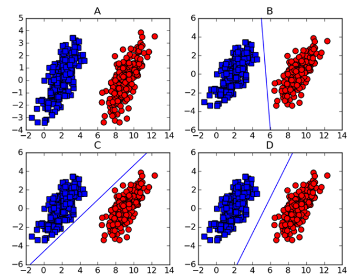

- 分类正确的前提下，找到最好的、最“正”的一个划分边界：
  
  - 最大间隔(margin)：使得边界距离数据点的【【最小距离】最大】
  - 分界（直线/平面/超平面）方程：$w^{T} x+b=0$
    - 例如：
      - 直线：$y=3x+1$
      - 平面：$z=3x+2y-3$
    - 分界线两侧，计算结果正负号不同
  - 目标函数：$\arg \max _{w, b}\left\{\min _{n}\left(\right.\right.$ label $\left.\left.\cdot\left(w^{T} x+b\right)\right) \cdot \frac{1}{\|w\|}\right\}$
    - label：根据真实类别，$1$或$-1$
      - 分界线两侧，计算结果正负号不同；算出是负数的一类对应$-1$
    - 点到直线的距离：$\frac{|w^{T} x+b|}{\|w\|}=$ label $\cdot\frac{\left(w^{T} x+b\right)}{\|w\|}$
    - 条件：每个点都分类正确，label $\cdot\left( w^{T} x+b\right)>0$
  - 目标函数的处理：$w, b$同时扩大$N$倍，结果没有影响，所以：
    - 令 $\min_n$ label $\cdot \left(w^{T} x+b\right)=1$ （如果等于$3$，则$w, b$同时变为原来的$\frac 13$）
    - 目标函数变成：$\arg \max _{w, b}\frac{1}{\|w\|}$ 也就是 $\arg \min _{w,b}\frac{\|w\|}{2}=\arg \min _{w,b}\frac{1}{2}w^Tw$
    - 条件：每个点都满足，label $\cdot\left( w^{T} x+b\right)\ge 1$
  - 条件放松：让每个点有出错的机会，不一定都得$\ge 1$
    - label $\cdot\left( w^{T} x+b\right)\ge 1-\xi$ and $\xi \ge 0$
    - 比如：3个点，结果分别是$5, -2, 0.5$，则三个$\xi$分别是$0,3,0.5$
    - 要对$\xi$进行惩罚，所以目标函数变成$\arg \min _{w,b,\xi}\left(\frac{1}{2}w^Tw+C\sum \xi\right)$
  - 如果不适合用直线，升维：
    - 如一个圈，在$x$和$y$的基础上加上一个$z=x^2+y^2$就更好进行划分了
      - 结果的分界线可能是$0x+0y+1z=1$，与之前的格式一致
      - 
    - 核函数（kernel function）：$K(x, y) = <f(x), f(y)>$
      - $f$代表升维的函数，比如
        - $f((a, b)) = (a, b, a^2 + b^2)$，$f([1,2])=[1,2,5]$
      - $<f(x), f(y)>$代表$f(x), f(y)$的内积，比如
        - $K(x,y)=x y+|x|^2|y|^2$
      - 高斯核/径向基函数 (Radial Basis Function 简称 RBF)：
        - $K\left(x, x^{\prime}\right)=e^{-\frac{\left\|x-x^{\prime}\right\|^{2}}{2 \sigma^{2}}}$
      - 线性核函数（相当于不用核函数）：
        - $K(x, y)=x \cdot y$
      - 多项式核函数：
        - $K(x, y)=(x \cdot y+c)^{d}$

- 求解：
  
  - 拉格朗日乘子法(lagrange multiplier)：
    - 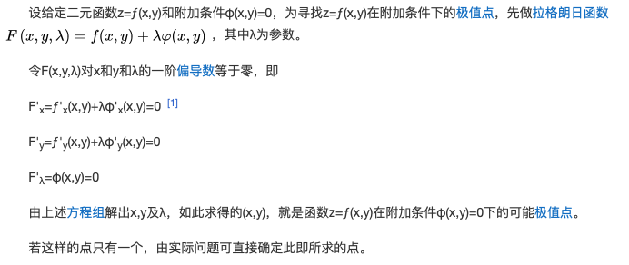
    - 
  - 拉格朗日对偶问题
    - 
  - $\min _{\alpha}\left(\frac{1}{2} \sum_{i j} \alpha_{i} \alpha_{j} y_{i} y_{j} x_{i}^{T} x_{j}-\sum_{i=1}^{N} \alpha_{i}\right)$
    s.t. $0 \leq \alpha_{i} \leq C, i=1,2, \ldots, N$
    $\sum_{i=1}^{N} \alpha_{i} y_{i}=0$

- SMO 算法：
  
  - 将问题简化为，我们每次只变动两个参数$\alpha$，与此同时固定其余所有的参数。

<div style="page-break-after: always;"></div>

### 4.6 AdaBoost

- 集成方法ensemble methods（元算法meta-algorithm）
  - 将其他算法进行组合
  - bagging：从原始数据集选择$S$次，得到$S$个新数据集，并行训练
  - boosting：串行训练
  - 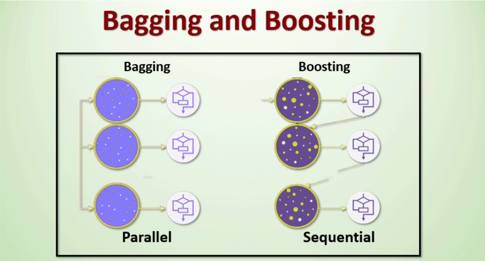
- Bagging的例子：
  - 随机森林（random forest）：随机森林是平均多个深决策树以降低变异数的一种方法，其中，决策树是在一个数据集上的不同部分进行训练的。
    - 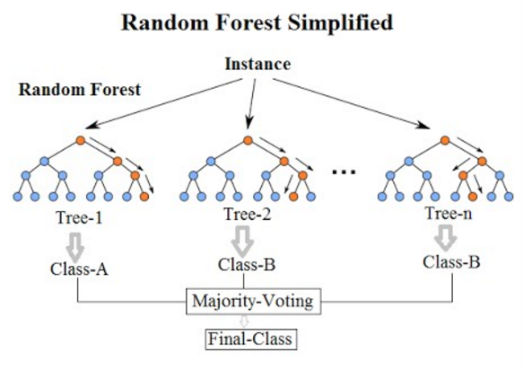
- AdaBoost
  - 把简单的分类器 组合（利用权重），分类器本身训练的时候也有数据权重
  - 强化练习：做错的章节之后重点关注
  - 
  - 错误率：$\varepsilon=\frac{\text { number of incorrectly classified examples }}{\text { total number of examples }}$
  - 分类器权重：$\alpha=\frac{1}{2} \ln \left(\frac{1-\varepsilon}{\varepsilon}\right)$
  - 分类正确的数据：$D_{i}^{(t+1)}=D_{i}^{(t)} e^{-\alpha}$；分类错误的数据：$D_{i}^{(t+1)}=D_{i}^{(t)} e^{\alpha}$。
    - 最后进行归一化处理（除以$sum(D)$）
  - 分类器：单层决策树
    - 
    - 判断每一个feature上每一个阈值对应的加权error

<div style="page-break-after: always;"></div>

## 五、回归模型

例如：某地之前几天的温度，预测今天的温度；根据前几天的播放量，预测今天的播放量。

`x1, x2, x3, x4` => `Y`

假如结果是：`Y = 0.1 * x1 + 0.2 * x2 + 0.3 * x3 + 0.5 * x4`，这里的`0.1, 0.2, 0.3, 0.5`是权重（weight），需要调整权重。

weight好不好的衡量：

- Y和真实的Y之间的差距（loss），可以取
  - MSE：Mean Squared Error，均方误差，$\frac{1}{m} \sum_{i=1}^{m}\left(y_{i}-{y}_{i}\right)^{2}$
  - RMSE：Root Mean Squard Error，均方根误差，$\sqrt{\frac{1}{m} \sum_{i=1}^{m}\left(y_{i}-{y}_{i}\right)^{2}}$
  - MAE：Mean Absolute Error，平均绝对误差，$\frac{1}{m} \sum_{i=1}^{m}\left|\left(y_{i}-\hat{y}_{i}\right)\right|$

让weight变得更好的两种方法：

- 用公式（如$\hat{w}=\left(\boldsymbol{X}^{T} \boldsymbol{X}\right)^{-1} \boldsymbol{X}^{T} y$，后面会推导）
- 更新weight达到更好的结果（更小的loss）。
  - 梯度下降：判断每个参数是增大还是减小能让loss变得更小，判断每个参数要增大/减小多少合适

<div style="page-break-after: always;"></div>

### 5.1 OLS（Ordinary least squares）

- $\mathrm{X}=\left[\begin{array}{cccc}X_{11} & X_{12} & \cdots & X_{1 p} \\ X_{21} & X_{22} & \cdots & X_{2 p} \\ \vdots & \vdots & \ddots & \vdots \\ X_{n 1} & X_{n 2} & \cdots & X_{n p}\end{array}\right], \quad \boldsymbol{\beta}=\left[\begin{array}{c}\beta_{1} \\ \beta_{2} \\ \vdots \\ \beta_{p}\end{array}\right], \quad \mathbf{y}=\left[\begin{array}{c}y_{1} \\ y_{2} \\ \vdots \\ y_{n}\end{array}\right] .$
- $\hat{\boldsymbol{\beta}}=\left(\mathrm{X}^{\top} \mathrm{X}\right)^{-1} \mathrm{X}^{\top} \mathbf{y}$
  - $S(\boldsymbol{\beta})=\sum_{i=1}^{n}\left|y_{i}-\sum_{j=1}^{p} X_{i j} \beta_{j}\right|^{2}=\|\mathbf{y}-\mathrm{X} \boldsymbol{\beta}\|^{2}$
  - 导数$-2\mathrm{X}^T(y-\mathrm{X}\hat\beta)=0$，解出：$\left(\mathrm{X}^{\top} \mathrm{X}\right) \hat{\boldsymbol{\beta}}=\mathrm{X}^{\top} \mathbf{y}$
- 

<div style="page-break-after: always;"></div>

### 5.2 Locally weighted regression

一种基于内存的方法，仅使用某个感兴趣点的局部训练数据，围绕该点执行回归

- A memory-based method that performs a regression around a point of interest using only training data that are **local** to that point

- $\hat{w}=\left(\boldsymbol{X}^{T} \boldsymbol{W} \boldsymbol{X}\right)^{-1} \boldsymbol{X}^{T} \boldsymbol{W}_{y}$

- $w(i, i)=\exp \left(\frac{\left|x^{(i)}-x\right|}{-2 k^{2}}\right)$
  
  - $x$是感兴趣的点，$x^{(i)}$是每条数据

- 

<div style="page-break-after: always;"></div>

### 5.3 Ridge regression

$\hat{\boldsymbol{\beta}}=\left(\mathrm{X}^{\top} \mathrm{X}\right)^{-1} \mathrm{X}^{\top} \mathbf{y}$中不一定能求逆。

$\hat{w}=\left(\boldsymbol{X}^{T} \boldsymbol{X}+\lambda \boldsymbol{I}\right)^{-1} \boldsymbol{X}^{T} y$

也相当于加了一个条件$\sum_{k=1}^{n} w_{k}^{2} \le t$

### 5.4 Tree-based regression

利用一些树状结构，进行回归任务。

比如：男性女性不同、不同年龄段不同……这样可以先用树状结构划分开。


<div style="page-break-after: always;"></div>

## 六、无监督——聚类

### 6.1 k-means

中心点查找：

- 数据距离中心点的距离=>属于哪个类别

k-means

- 先随机k中心点
- 数据根据中心点进行归类
- 再更新k个中心点

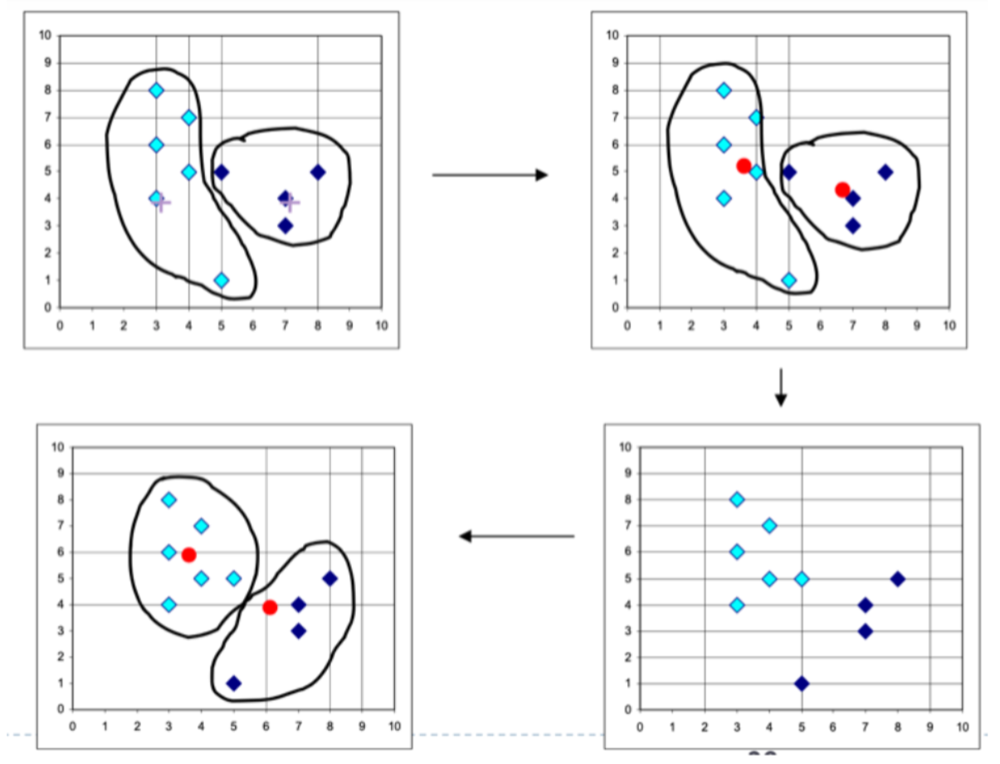

<div style="page-break-after: always;"></div>

## 七、无监督——关联分析


- support：同时出现的概率
  - the percentage of the dataset that contains this itemset
- confidence：条件概率，买了A的情况下买B的概率
  - e.g. an association rule like {diapers} ➞ {wine}.
    - The confidence for this rule is defined as support({diapers, wine})/support({diapers})）

要找到support比较高的（freq set），如果能够找到support值，直接做个除法就可以算出confidence，所以关键在于找freq set并记录每个组合的support值。后面两个方法就是这个目的。

<div style="page-break-after: always;"></div>

### 7.1 Apriori

构造一种体现包含关系（子集关系）的结构，如果{2,3}不符合要求（共同出现次数太少），那包含{2,3}的（比如{1,2,3}）出现的次数不会更多，所以可以直接通过一个不符合要求的删除下面相连的更多数据。


计算confidence的时候，可以画出分子一样的条目（比如下图中所有的分子都是{0,1,2,3}的support），但分母不同（比如$012\rightarrow 3$分母是{0,1,2}的support），因为分母有大小关系，所以如果上面的节点confidence不符合要求的阈值，下面的也可以直接忽略掉。


<div style="page-break-after: always;"></div>

### 7.2 FP-growth

构造了一个FP-tree结构，可以方便地找到若干个物品同时出现的次数。

不同物品会有排序，比如下图的排序是：z,x,y,s,r,t。

如果想分析s和x同时出现的次数，排序里面s在x下面，所以找到s的header，发现连接的两个s节点，上面都有x，所以s和x同时出现的次数是2+1=3次。


下面是一个构造过程的例子。


<div style="page-break-after: always;"></div>

## 八、无监督——降维

### 8.1 PCA（主成分分析）

基本思想是找到几个比较合适的新的坐标轴，从而将原始数据投影到对应位置。

先进行中心化处理，PCA方法对应的选择合适坐标轴的指标是：

- 最小投影距离
- 最大投影方差


实际上是在选择$XX^T$前$k$个最大的特征值对应的特征向量

<div style="page-break-after: always;"></div>

### 8.2 SVD（奇异值分解）

严格来说，SVD并不是降维的方法，但它可以用于进行数据压缩，所以也放在了这个位置。

基本原理如下图：将原始矩阵进行SVD操作，得到三个矩阵，并且可以将原始矩阵拆分：


第二个矩阵的数是从大到小排序的，所以可以只保留前几项，得到一个近似的结果。


推荐系统中的应用：


